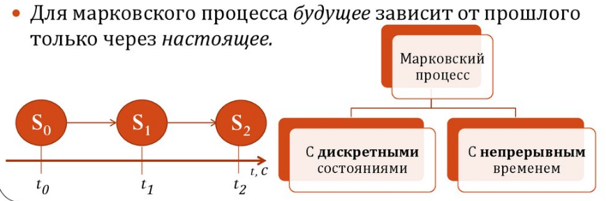

# Билет №5. Марковский процесс.

Для марковского случайного процесса вероятность любого события в будущем не зависит от предыстории, а это означает, что вероятность перехода не зависит от $t$, то есть количества времени, которое система провела в состоянии $X_i$.

В итоге вероятность перехода определяется как вероятность того, что за время $\Delta t$ появится событие, переводящее систему из состояния $X_i$ в состояние $X_j$. Для достаточно малого значения $\Delta t$ эта вероятность пропорциональна значениям $\Delta t$ ***и интенсивности переходов*** $\lambda _{ij}$ :

$$p_{ij}(\Delta t)≈\lambda _{ij}*\Delta t$$

$$i,j = \overline{1...n}$$

Марковский процесс, протекающий в системах со счетным множеством состояний и непрерывным временем, можно описать с помощью обыкновенных дифференциальных уравнений, в которых неизвестными функциями являются вероятности состояний $p_1(t),p_2(t),...,p_n(t)$

## Создатель

Автор расписанного билета: Топчий Женя и Смирнов Костя

Кто проверил:

## Ресурсы
- лекции
- лекции Рогова А.А.
