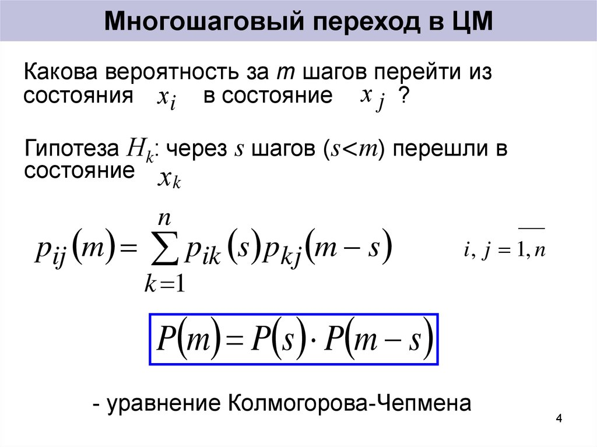

# Билет №13. Формула нахождения вероятности перехода за m шагов.

**Определение:** Пусть стационарное распределение — вектор $p^* = (p_1^* ,\dots, p_N^* )$, удовлетворяющий условиям $p_i^* \geq 0 ; 1\leq i\leq N$

Тогда $\displaystyle \sum_{i=1}^m p_i^* =1, \sum_{k=1}^mp_k^* p_{kj}=p_j^* , 1\leq i\leq m$ , где $p_{ij}$  — вероятность перехода

**Утверждение:** Если в цепи Маркова $p(\xi_0 = k)=p_k(0)=p_k^* $, то при $\forall N, p(\xi_N=j)=p_j^* , 1\leq i\leq m$ 

## Создатель

Автор расписанного билета: Квист Татьяна

Кто проверил:

## Ресурсы
- лекции Рогова А.А.
