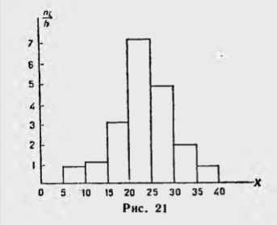

# Билет №17. Гистограмма.

В случае непрерывного признака целесообразно строить гистограмму, для чего интервал, в ко­тором заключены все наблюдаемые значения признака, разбивают на несколько частичных интервалов длиной $***h$*** и находят для каждого частичного интервала $n_i$ — сумму частот вари­ант, попавших в $i$-й интервал.

*Гистограммой ча­стот* называют ступен­чатую фигуру, состоя­щую из прямоугольни­ков, основаниями кото­рых служат частичные интервалы длиною $*h$,* а высоты равны отноше­нию $n_i/h$ **(плотность ча­стоты).

Для построения гистограммы частот на оси абсцисс откладывают частичные интервалы, а над ними проводят отрезки, параллельные оси абсцисс на расстоянии $n_i/h$.

Площадь $i$-го частичного прямоугольника равна $*hn_i/h = n_i$* — сумме частот вариант $i$-ro интервала; следо­вательно, *площадь гистограммы частот равна сумме всех частот*, *т. е. объему выборки.
Гистограммой относительных частот* называют сту­пенчатую фигуру, состоящую из прямоугольников, осно­ваниями которых служат частичные интервалы длиною $*h$,* а высоты равны отношению $*W_i/h$* (плотность относитель­ной частоты).
Для построения гистограммы относительных частот на оси абсцисс откладывают частичные интервалы, а над ними проводят отрезки, параллельные оси абсцисс на расстоянии $*W_i/h$.* Площадь $*i$-*го частичного прямоуголь­ника равна $*hW_i/h = W_i*$,— относительной частоте вариант, попавших в $i$-й интервал. Следовательно, *площадь гисто­
граммы относительных частот равна сумме всех отно­сительных частот, т. е. единице.*

## Создатель

Автор расписанного билета: Куусела Демид

Кто проверил:

## Ресурсы

Гмурман В.У. Теория вероятностей и математическая статистика
