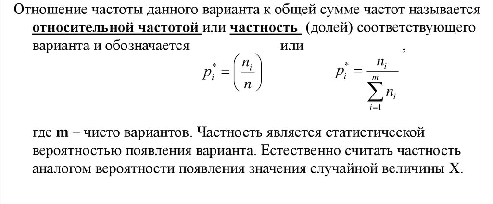

# Билет №18. Вариационный ряд.

***Вариационным рядом*** называется упорядоченная по возрастанию выборка.

Элемент вариационного ряда называется ***вариантой***.

А ***размахом*** называется разница между максимальной и минимальной вариантами выборки.

Число, показывающее, сколько раз встречаются соответствующие значения вариантов в ряде наблюдений, называется ***частотой или весом варианта(элемента)***, и обозначается $n_i$, где i - номер варианта.

## Создатель

Автор расписанного билета: Топчий Женя и Смирнов Костя

Кто проверил:

## Ресурсы
- лекции
- лекции Рогова А.А.

