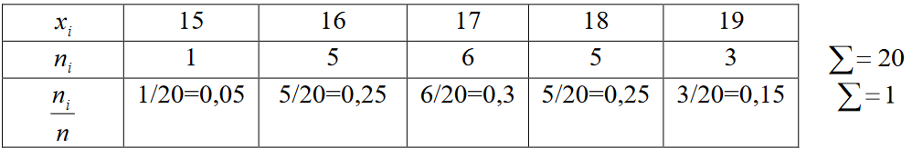
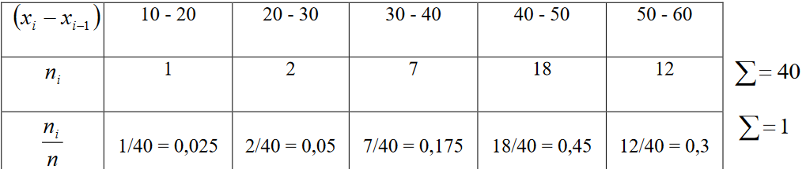

# Билет №20. Стат. ряд частностей.

## Прелюдия

Любое множество, подлежащее изучению в статистике, называется ***генеральной совокупностью***. Любое подмножество генеральной совокупности называется ***выборкой***. Количество элементов в генеральной совокупности или в выборке называется ***объемом***. Элементы выборки могут характеризоваться числами, отражающими какой-либо признак изучаемого объекта. Эти числа называются ***вариантами***, так как от выборки к выборке эти значения меняются.

Первым шагом в обработке полученных данных является составление статистического или вариационного ряда.

## Определение

***Статистический ряд*** – это таблица, в которой перечислены варианты в порядке возрастания и указаны соответствующие им частоты.

Для графического изображения статистического ряда частот служит ломаная в прямоугольной декартовой системе координат - [полигон](../question21/README.md).

Для графического изображения сгруппированной выборки служит ступенчатая фигура из прямоугольников, называемая [гистограммой](../question17/README.md).

$\displaystyle \beth \xi$ - дискретная СВ; задаётся законом распределения $\displaystyle (\tilde x_i,P_i)_{i \in I} $

Вариационный ряд частностей (относительных частот):

$\displaystyle \tilde x_1$ | $\displaystyle \tilde x_2$ | $\displaystyle \cdots$ | $\displaystyle \tilde x_k$
:---: | :---: | :---: | :---:
$\displaystyle \omega_1$ | $\displaystyle \omega_2$ | $\displaystyle \cdots$ | $\displaystyle \omega_k$ |

$\displaystyle \omega_i = \frac{n_i}{n}$ - относительная частота.

$\displaystyle n_i$ - кол-во элементов $\displaystyle \tilde x_i$, оказавшихся в выборке. 

$\displaystyle \sum_{i=1}^{k} \omega_i = 1 $

## Пример

*статистический ряд частот и относительных частот*

*сгрупированный статистический ряд частот и относительных частот*

## Создатель

Автор расписанного билета: Клюшов Никита

Кто проверил: Топчий Женя и Смирнов Костя

## Ресурсы
- записи лекций Рогова с прошлого года
- [сторонний ресурс](https://pnu.edu.ru/media/filer_public/2013/02/14/kr-11.pdf)
