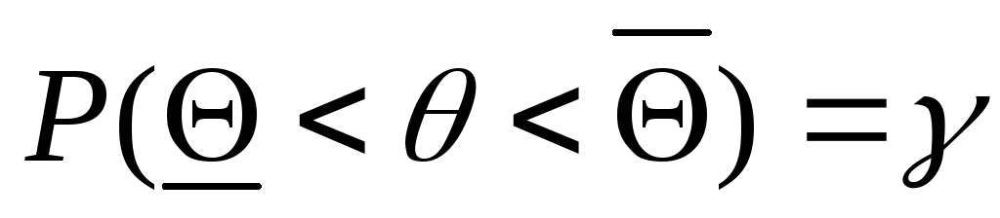
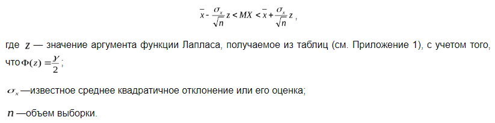

# Билет №45. Интервальные оценки, доверительный интервал.

Точечные оценки параметров не дают информации о степени близости к соответствующему теоретическому параметру. Если объем выборки мал, то точечная оценка может значительно отличаться от оцениваемого параметра, т.е. приводить к грубым ошибкам. Вычисленная точечная оценка может быть близка к оцениваемому параметру, а может и очень сильно отличаться от него. Точечная оценка не несет информацию о точности процедуры оценивания.

***Интервальная оценка*** – это числовой интервал, который определяется двумя числами – границами интервала - и содержащий неизвестный параметр генеральной совокупности.

Пусть имеется выборка объема $n$ и ${\displaystyle \Theta }$ * - статистическая оценка неизвестного параметра $\theta$( ${\displaystyle \Theta }$ *- случайная величина, т.к. найдена по выборочным данным).

***Доверительным интервалом*** называется интервал со случайными границами ( $\underline{\Theta}$, $\overline{\Theta}$), в котором с заданной вероятностью $\gamma$ находится оцениваемый параметр $\theta$

Вероятность $\gamma$ называется доверительной вероятностью.

Доверительная вероятность задается априорно. Чем ближе $\gamma$ к единице, тем точнее оценка. Для практических целей обычно выбирают $\gamma$ = 0,95; 0,99 или 0,9973. Доверительная вероятность, например, 0,95 означает, что мы пренебрегаем возможностью появления события (считаем его невозможным), вероятность которого меньше 1-0,95=0,05.

Т.к. при различных выборках получаются различные значения оценки $\Theta$ * , то и доверительные границы изменяются от выборки к выборке. Поэтому лучше говорить не о вероятности попадания параметра в доверительный интервал, а о вероятности того, что доверительный интервал накроет параметр $\theta$.

Доверительный интервал применяется в случае сравнительно небольшого объема выборки, когда предполагается, что надежность точечной оценки может быть невысокой.

Доверительный интервал для оценки математического ожидания случайной величины $X$ с заданной надежностью $\gamma$ в случае нормального закона распределения определяется на основе неравенств

## Создатель

Автор расписанного билета: Топчий Женя и Смирнов Костя

Кто проверил:

## Ресурсы
- лекции
- лекции Рогова А.А.

