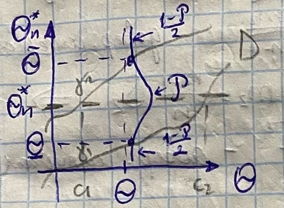

# Билет №48. Доверительный интервал для мат. ожидания при неизвестной дисперсии нормального распределения генеральной совокупности

**Теорема 2 о распределении случайной величины $\frac{x - a}{\sqrt{m_2}}\sqrt{n - 1}$**

Пусть $X_1$, $X_2$, ..., $X_n$ - независимые случайные величины $\sim N(a,\sigma)$

Рассмотрим $\overline{x} = \frac{1}{n}\sum\limits_{i=1}^n X_i$ (выборочное среднее) и $m_2 = \frac{1}{n}\sum\limits_{i=1}^n (X_i - \overline{x})^2$ (выборочная дисперсия)

Величина $\Huge\frac{\overline{x}-a}{\sqrt{m_2}}\sqrt{n-1} \sim t_{n-1}$ - имеет распределение Стьюдента с $n-1$ степенями свободы 

Пусть случайная велчина $\xi \sim N(\alpha,\sigma)$, $\alpha$ и $\sigma$ неизвестны

По теореме 2 $\Huge\frac{\overline{x}-a}{\sqrt{m_2}}\sqrt{n-1} \sim t_{n-1} = \xi_{n-1}(x)$ - распределение Стьюдента с $n-1$ степенями свободы 

Квантиль распространения Лапласа $\rho$ задан

$\Huge\displaystyle \int_{-t_\rho}^{t_\rho} \xi_{n-1}(x)dx = \rho => P(-t_\rho < \frac{\overline{x}-a}{\sqrt{m_2}}\sqrt{n-1} < t_\rho) = \rho$

$\Huge\displaystyle (+) => \overline{x} - t_\rho\frac{m_2}{\sqrt{n-1}} < \alpha < \overline{x} + t_\rho\frac{m_2}{\sqrt{n-1}};$

$\Huge\displaystyle S_2 = \frac{1}{n-1} \sum_{i=1}{n}(x_i - \overline{x})^2 = \frac{n}{n-1}m_2, m_2 = \frac{n}{n-1}S_2 =>$

$\Huge\displaystyle (++) => \overline{x} - t_\rho\sqrt{\frac{\xi_2}{n}} < \alpha < \overline{x} + t_\rho\sqrt{\frac{S_2}{n}};$

## Создатель

Автор расписанного билета: Лисицкий Олег

Кто проверил:

## Ресурсы
- лекции Рогова А.А.
