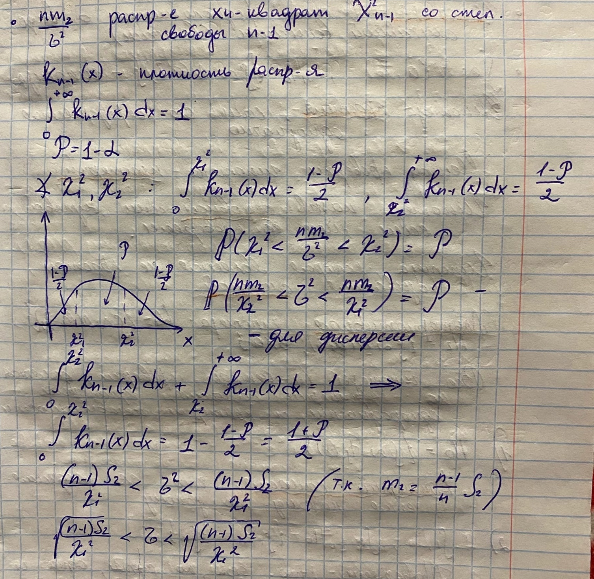

# Билет №50. Построение доверительного интервала для среднеквадратичного отклонения и дисперсии нормального распределения генеральной совокупности.

## Создатель

Автор расписанного билета: Лисицкий Олег

Кто проверил:

## Ресурсы
- лекции Рогова А.А.
