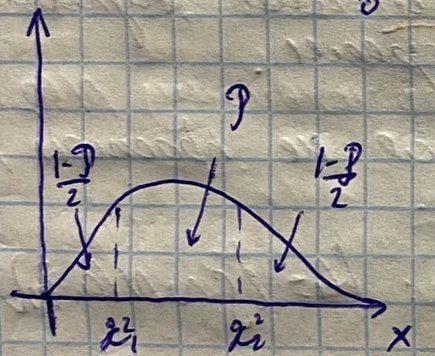

# Билет №50. Построение доверительного интервала для среднеквадратичного отклонения и дисперсии нормального распределения генеральной совокупности.

$\Huge \frac{nm_2}{\sigma^2}$ - распространение Хи-Квадрат $\Huge X_{n-1}^2$ со степенью свободы $n-1$

$\Huge K_{n-1}(x)$ плотность распределения

$\Huge \int_0^{+\infty} K_{n-1}(x) dx = 1$

$\Huge \rho = 1 -\alpha$

Рассмотрим $x_1^2$ и $x_2^2$:

$\Huge \int_0^{x_1^2} K_{n-1}(x) dx = \frac{1-\rho}{2}; \int_{x_2^2}^{+\infty} K_{n-1}(x) dx = \frac{1-\rho}{2}$

$\Huge P(x_1^2 <\frac{nm_2}{\sigma^2} < x_2^2) =\rho$

$\Huge P(\frac{nm_2}{x_2^2} < \sigma^2 < \frac{nm_2}{x_1^2}) =\rho$ - для дисперсии

$\Huge \int_0^{x_1^2} K_{n-1}(x) dx + \int_{x_2^2}^{+\infty} K_{n-1}(x) dx = 1 =>$

$\Huge \int_0^{x_1^2} K_{n-1}(x) dx = 1 - \frac{1-\rho}{2} = \frac{1+\rho}{2}$

Т.к. $m_2  = \frac{(n-1)}{n}S_2$

$\Huge\frac{(n-1)S_2}{x_2^2} < \sigma^2 < \frac{(n - 1)S_2}{x_1^2}$

$\Huge \sqrt{\frac{(n-1)S_2}{x_2^2}} < \sigma < \sqrt{\frac{(n - 1)S_2}{x_1^2}}$

## Создатель

Автор расписанного билета: Лисицкий Олег

Кто проверил:

## Ресурсы
- лекции Рогова А.А.
