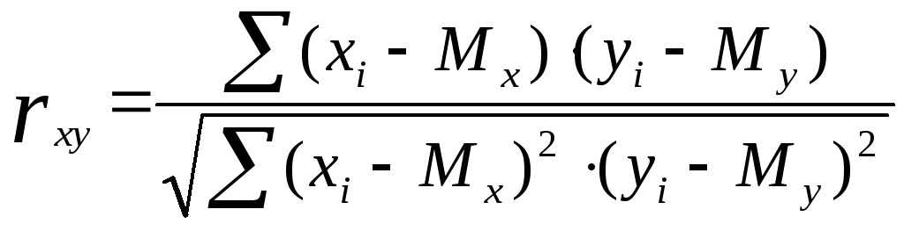
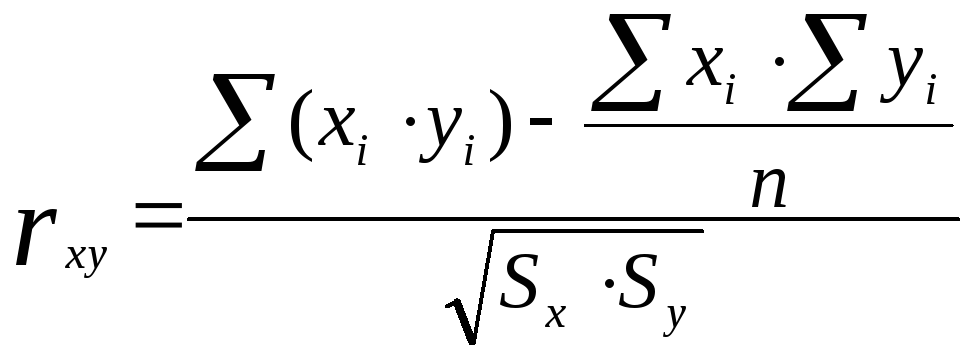
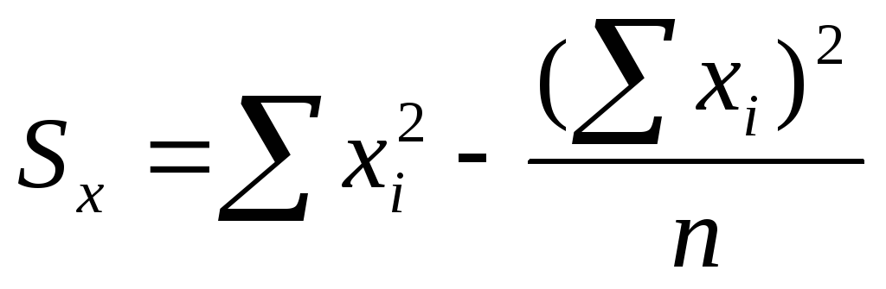

# Билет №59. Статическая оценка коэффициента корреляции Пирсона.

Коэффициент корреляции Пирсона характеризует наличие только линейной связи между признаками, обозначаемыми, как правило, символами X и Y. Формула расчета коэффициента корреляции построена таким образом, что, если связь между признаками имеет линейный характер, коэффициент Пирсона точно устанавливает тесноту этой связи. Поэтому он называется также коэффициентом линейной корреляции Пирсона.

Величина коэффициента линейной корреляции Пирсона не может превышать +1 и быть меньше чем -1. Эти два числа +1 и -1 – являются границами для коэффициента корреляции. Когда при расчете получается величина большая +1 или меньшая -1 – следовательно, произошла ошибка в вычислениях.

Если коэффициент корреляции по модулю оказывается близким к 1, то это соответствует высокому уровню связи между переменными. Так, в частности, при корреляции переменной величины с самой собой величина коэффициента корреляции будет равна +1. Подобная связь характеризует прямо пропорциональную зависимость. Если же значения переменной X будут распложены в порядке возрастания, а те же значения (обозначенные теперь уже как переменная Y) будут распола­гаться в порядке убывания, то в этом случае корреляция между переменными X и Y будет равна точно –1. Такая величина коэффициента корреляции характеризует обратно пропорциональную зависимость.

Знак коэффициента корреляции очень важен для интерпретации полученной связи. Подчеркнем еще раз, что если знак коэффициента линейной корреляции – плюс, то связь между коррелирующими признаками такова, что большей величине одного признака (переменной) соответствует большая величина другого признака (другой переменной). Иными словами, если один показатель (переменная) увеличивается, то соответственно увеличивается и другой показатель (переменная). Такая зависимость носит название прямо пропорциональной зависимости.

Если же получен знак минус, то большей величине одного признака соответствует меньшая величина другого. Иначе говоря, при наличии знака минус, увеличению одной переменной (признака, значения) соответствует уменьшение другой переменной. Такая зависимость носит название обратно пропорциональной зависимости. При этом выбор переменной, которой приписывается характер (тенденция) возрастания – произволен. Это может быть как переменная X, так и переменная Y.

В общем виде формула для подсчета коэффициента корреляции такова:

где $x_i$ – значения, принимаемые переменной X;

$y_i$ – значения, принимаемые переменной Y;

$М_х$ – средняя по X;

$М_у$ – средняя по Y.

Расчет коэффициента корреляции Пирсона предполагает, что переменные X и Y распределены по нормальному закону.

Формула предполагает, что из каждого значения $x_i$ переменной X, должно вычитаться ее среднее значение $М_х$. Это неудобно. Поэтому для расчета коэффициента корреляции используют не эту формулу, а ее аналог, получаемый простыми преобразованиями:

где:

## Создатель

Автор расписанного билета: Топчий Женя и Смирнов Костя

Кто проверил:

## Ресурсы
- лекции
- лекции Рогова А.А.

