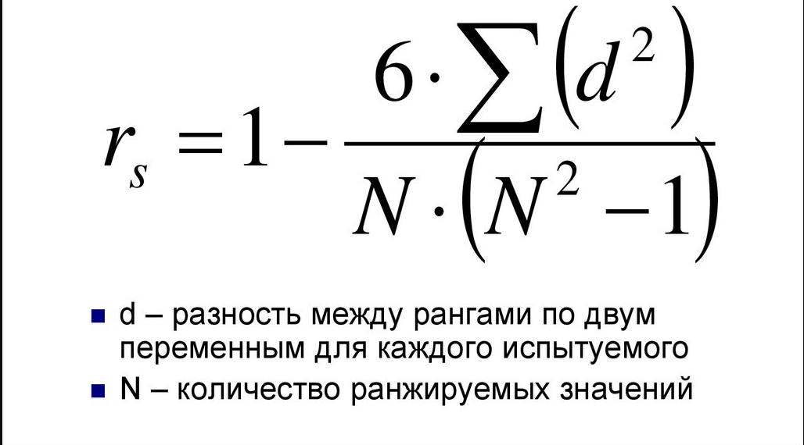

# Билет №60. Коэффициент корреляции Спирмана.

***Коэффициент ранговой корреляции Спирмана***

Используется для измерения взаимозависимости между качественными признаками, значения которых могут быть упорядочены или проранжированы по степени убывания(возрастания)
данного качества.

***Метод Спирмена*** определяет тесноту(силу) и направление корреляционной свзязи между двумя признаками или профилями признаков

## Создатель

Автор расписанного билета: Топчий Женя и Смирнов Костя

Кто проверил:

## Ресурсы
- лекции
- лекции Рогова А.А.

