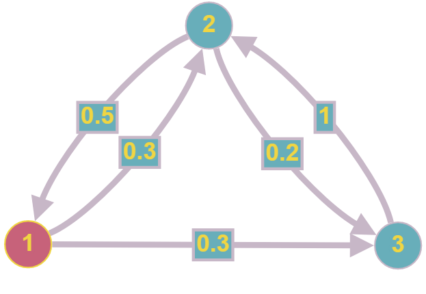

# Билет №7. Способ задания цепи Маркова..

1. Представление в виде графа

Марковскую цепь можно представить в виде графа, где вершины - состояния, дуги - вероятности перехода из одного состояния в другое.

## Создатель

Автор расписанного билета: Топчий Женя и Смирнов Костя

Кто проверил:

## Ресурсы
- лекции
- лекции Рогова А.А.

